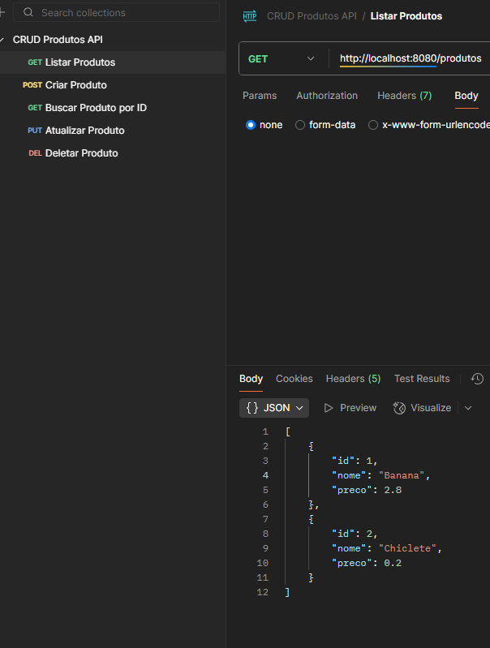
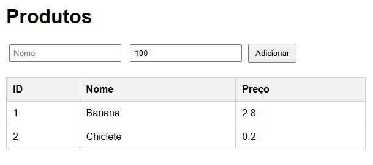

# 📦 Projeto CRUD com Spring Boot

Este repositório foi criado como estudo para aprender **Java com Spring Boot** e desenvolver um sistema de CRUD (Create, Read, Update, Delete).  
O projeto cobre tanto **API REST** quanto **páginas dinâmicas com Thymeleaf**.  

---

## 🖼️ Screenshots

### 📬 Postman - testando API

### 🌿 Thymeleaf - Lista de produtos

---

## 🚀 Tecnologias que aprendi aqui

- **Java** → Programação orientada a objetos, classes, atributos, construtores, getters e setters.  
- **Spring Boot** → Configuração rápida de aplicações web em Java.  
- **Spring Web (Spring MVC)** → Criação de Controllers e mapeamento de rotas com `@GetMapping`, `@PostMapping`, etc.  
- **Spring Data JPA** → Acesso ao banco de dados usando `JpaRepository`, sem precisar escrever SQL manual.  
- **H2 Database** → Banco de dados em memória para testes.  
- **Thymeleaf** → Templates dinâmicos integrados ao back-end, renderizando HTML com dados do Java.  
- **HTML + CSS** → Criação de formulários, tabelas e páginas estilizadas.  
- **Postman** → Testes de rotas REST enviando requisições `GET`, `POST`, `PUT` e `DELETE`.  

---

## 📂 Estrutura do Projeto

- **Model** → Classe `Produto` representando a entidade.  
- **Repository** → Interface `ProdutoRepository` para persistência.  
- **Controller** → Classe `ProdutoController` responsável pelas rotas.  
- **Templates (Thymeleaf)** → Páginas HTML para listar, cadastrar e editar produtos.  

---

## 🔥 O que eu aprendi na prática

- Criar um **CRUD completo** em Java com Spring.  
- Integrar **back-end e front-end** usando Thymeleaf.  
- Construir e testar uma **API REST**.  
- Usar banco de dados **em memória (H2)**.  
- Entender o fluxo completo: **Model → Repository → Controller → View**.  

---

## 🔄 Melhorias (Atualização)

### Validação de Dados

Neste projeto, todos os produtos passam por validação antes de serem salvos:

- **Nome**: obrigatório (`@NotEmpty`)  
- **Preço**: obrigatório e deve ser positivo (`@NotNull` e `@Positive`)  

  No **Controller**, o `@Valid` garante que o Spring verifique essas regras antes de persistir o produto. Caso algum dado esteja inválido, uma mensagem de erro é retornada, evitando que produtos inválidos sejam salvos no banco.
---

## 🛠️ Próximos Passos

- Aprender mais sobre **Validação com Spring Validation**.  
- Substituir H2 por um banco real, como **PostgreSQL ou MySQL**.  
- Criar autenticação simples (login) com **Spring Security**.  
- Evoluir para **front-end moderno** (React, Angular ou Vue) consumindo a API REST.  

---

✍️ **Aprendizagem contínua**: Esse projeto foi meu ponto de partida no mundo Spring Boot 🚀  
